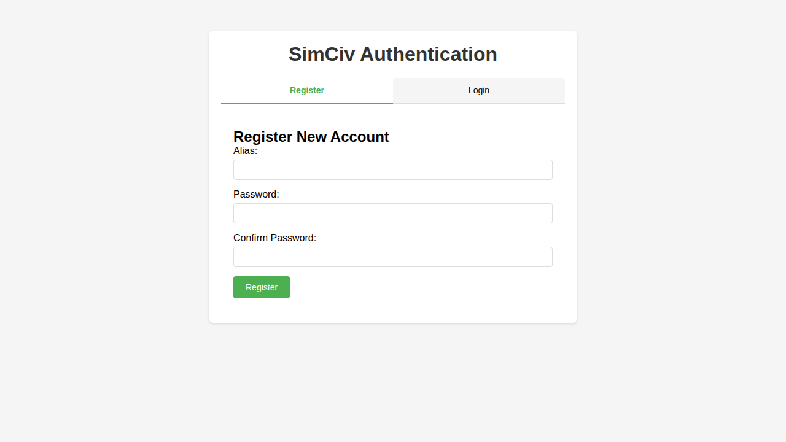
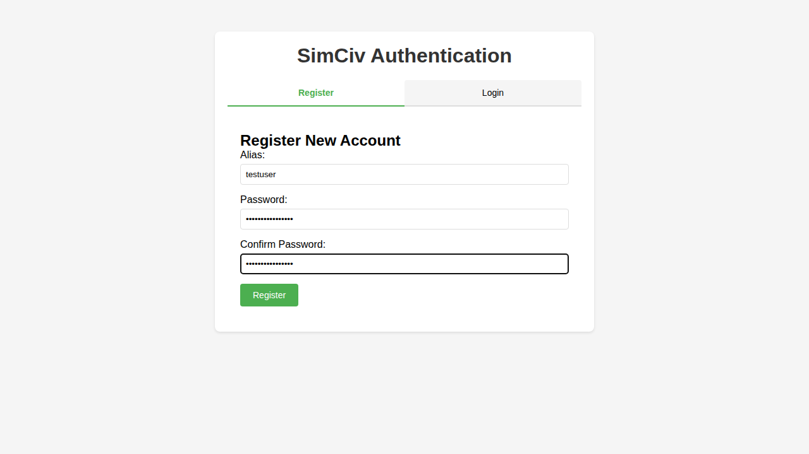
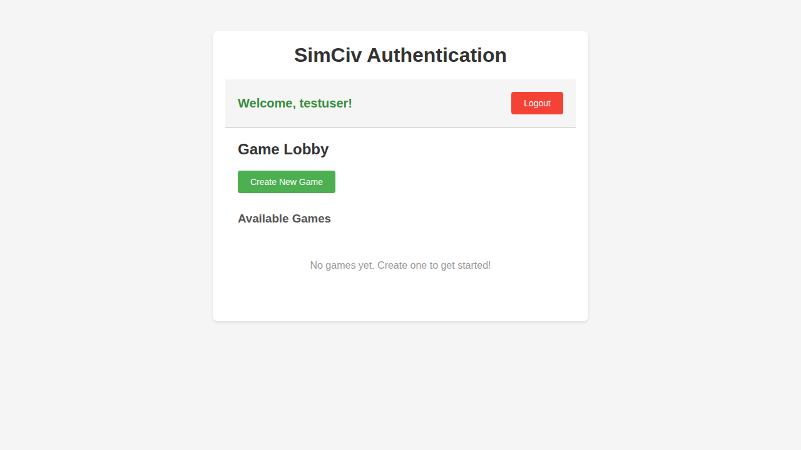
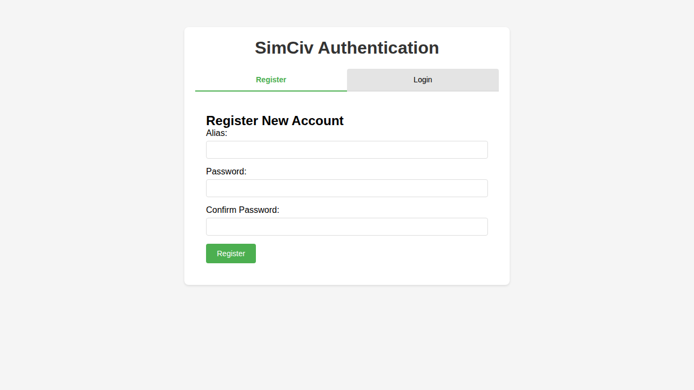

# Test: User Authentication

## Overview

This test verifies the complete user authentication flow including registration, logout, and login. It represents the primary user journey for account creation and authentication in SimCiv.

## Screenshots

### 000-initial-load.png

**Programmatic Verification:**

- ✓ Page title contains "SimCiv Authentication"
- ✓ Register tab is active by default
- ✓ Registration form is visible
- ✓ Password field is visible
- ✓ Password confirmation field is visible

**Manual Visual Verification:**

- Verify page styling and layout
- Check tab styling and active state
- Confirm form field styling
- Check button styling

### 001-registration-form-filled.png

**Programmatic Verification:**

- ✓ Alias field contains "testuser"
- ✓ Password field is filled
- ✓ Password confirmation field matches
- ✓ Submit button is enabled

**Manual Visual Verification:**

- Verify input field styling with content
- Check button hover states
- Confirm password masking (dots/asterisks)

### 002-registration-complete.png

**Programmatic Verification:**

- ✓ Success message is displayed
- ✓ Authenticated section is visible
- ✓ User alias "testuser" is displayed correctly

**Manual Visual Verification:**

- Verify success message styling
- Check authenticated user layout
- Confirm user info display
- Verify game lobby UI elements

### 003-after-logout.png

**Programmatic Verification:**

- ✓ Login/register tabs are visible again
- ✓ Register tab is present
- ✓ Authenticated section is no longer visible

**Manual Visual Verification:**

- Verify logout returns to unauthenticated state
- Check tab styling
- Confirm no authenticated user elements visible

