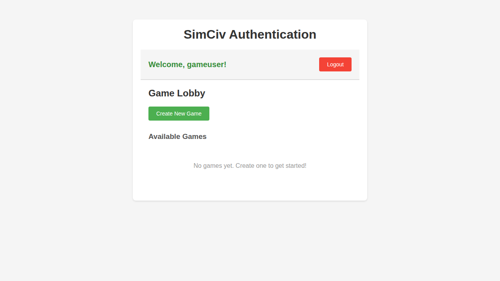
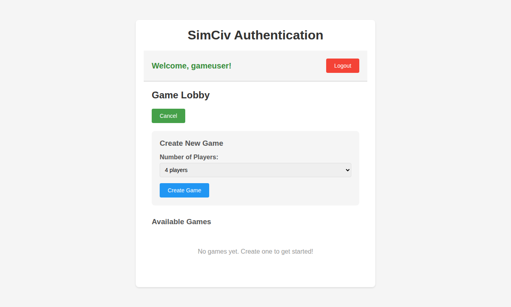
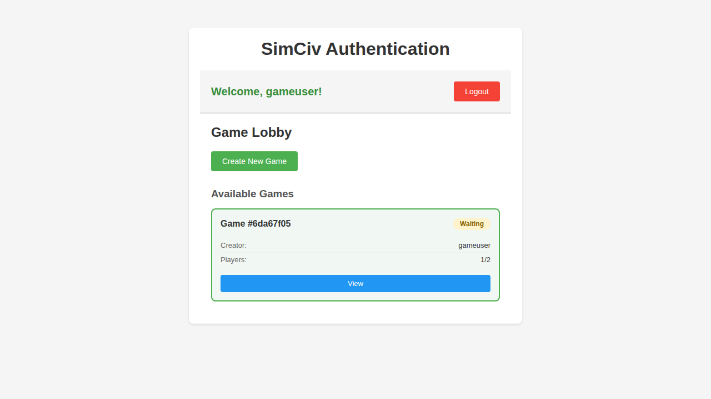
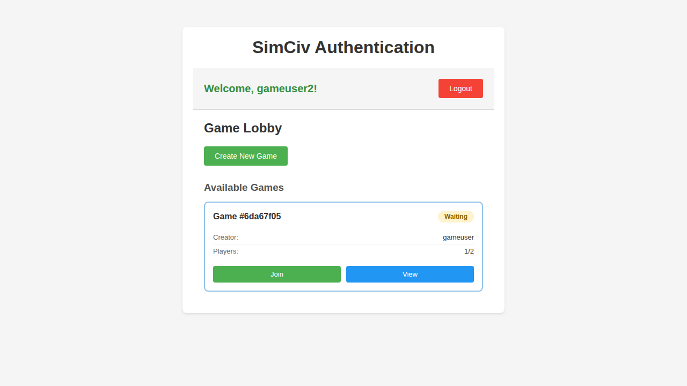
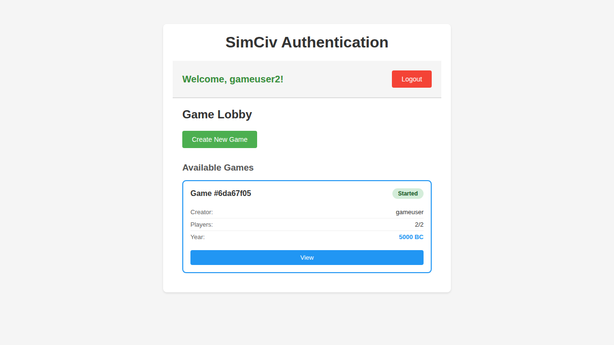

# Test: Game Creation and Lobby

## Overview

This test verifies the complete game creation and lobby workflow including creating games, joining games, and managing game state. It represents the core multiplayer game setup experience in SimCiv.

## Screenshots

### 009-game-lobby-authenticated.png

**Programmatic Verification:**

- ✓ Game Lobby header is visible
- ✓ Create New Game button is visible

**Manual Visual Verification:**

- Verify game lobby layout and styling
- Check button styling and positioning
- Confirm user information is displayed

### 010-game-create-form.png

**Programmatic Verification:**

- ✓ Create New Game form header is visible
- ✓ Max Players selector is visible

**Manual Visual Verification:**

- Verify create game form layout
- Check form field styling
- Confirm select dropdown appearance

### 011-game-created.png

**Programmatic Verification:**

- ✓ Game card is visible in lobby
- ✓ Game state shows "Waiting" for players

**Manual Visual Verification:**

- Verify game card layout and styling
- Check game state badge appearance
- Confirm game information display

### 012-game-waiting-for-players.png

**Programmatic Verification:**

- ✓ View button is available for creator

**Manual Visual Verification:**

- Verify game is in waiting state
- Check available actions for game creator

### 013-game-second-player-view.png

**Programmatic Verification:**

- ✓ Game is visible to other players in lobby
- ✓ Join button is available for second player

**Manual Visual Verification:**

- Verify second player can see the game
- Check join button styling and placement

### 014-game-started.png

**Programmatic Verification:**

- ✓ Game state changed to "Started" after second player joined

**Manual Visual Verification:**

- Verify game state badge shows "Started"
- Check that game now shows started state styling

### 015-game-time-initial.png

**Programmatic Verification:**

- ✓ Game year is displayed
- ✓ Initial year is 5000 BC

**Manual Visual Verification:**

- Verify game time display is visible and readable
- Check time formatting and styling

### 016-game-time-progressed.png

**Programmatic Verification:**

- ✓ Year progressed to 4999 BC after game tick

**Manual Visual Verification:**

- Verify time has updated correctly
- Check that year display refreshed

### 017-game-full-no-join.png

**Programmatic Verification:**

- ✓ Full game shows "Started" state without join button
- ✓ Join button is not visible for full games

**Manual Visual Verification:**

- Verify third player cannot join full game
- Check that started games show correct state

